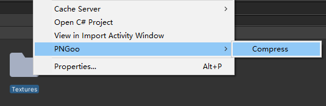
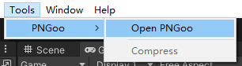

[README English](README.md)
[README Chinese](README-cn.md)

此fork版本的PNGoo修改如下:
=====

- 升级框架到.NET Framework 4.7.2.
- 文件夹多选对话框 (可多选, 递归选择, 包含当前目录及其所有的子目录内的.png文件).
- 如果压缩后的文件大小更大且原文件不是PNG编码，则不会覆盖原文件，除非勾选了Force PNG复选框。
- 新增支持命令行运行参数:
    - "-p" / "-Path": 要压缩的目标文件或目标目录（同时支持具体的文件路径或目录路径，可输入多个路径，使用"|"作为分隔符）。
    - "-OutputPath": 压缩后PNG文件的输出路径，如果没有该参数，则输出路径为原文件所在路径，即覆盖原文件。
    - "-ForcePng": 该选项强制把文件压缩为PNG格式和PNG编码，哪怕原文件不是PNG编码。这将会覆盖那些非PNG编码的文件（包含非PNG编码但文件却是.png扩展名的文件，例如JPG编码但扩展名为.png），哪怕压缩后的文件占用空间更大也会覆盖原文件。
    - "-OverwriteIfLarger": 是否覆盖原文件，尽管压缩结果文件占用空间更大。

    示例: PNGoo.exe -Path="C:/YourPngFilesPath/|C:/YourPngFilesPath2/|C:/YourPngFile.png" -OutputPath="C:/YourPngOutputPath/" -ForcePng="false" -OverwriteIfLarger="false"

PNGoo的Unity编辑器扩展:
=====

- 把目录ExtensionForUnity中的PNGooTools.cs脚本文件放到Unity项目的Editor目录下，并且修改PNGooTools.cs中的PNGooPath为你的PNGoo程序位置，同时把PNGoo.exe及其依赖文件放入Unity项目中。
- 使用方法如下:
    - 选中要压缩的png图片或目录，支持同时选择png图片和文件夹，支持多选，右键选择"PNGoo -> Compress"，即可完成压缩。或点击菜单"Tools -> PNGoo -> Compress"，即可完成压缩。Unity进程将一直等待直到关闭PNGoo。
    - 点击菜单"Tools -> PNGoo -> Open PNGoo"，即可打开PNGoo程序，该命令不会导致Unity进程等待。

