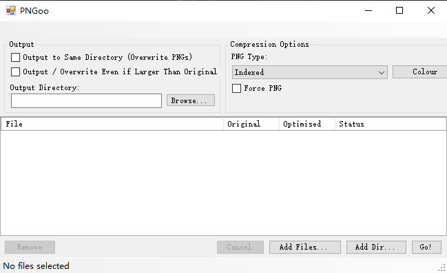
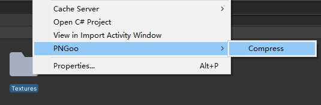
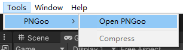

[中文版README](README-cn.md)

The modifications of this forked version of PNGoo:
=====

- Update to .NET Framework 4.7.2.
- Multi -folder selection (multiple selection, recursive selection, including all the .png format files in all sub -directory).
- The original file will not be covered if the compressed file size is larger and the original file is not encoded in PNG format, unless the check box of Force PNG is checked.
- Added support for arguments during command-line execution:
    - "-p" / "-Path": The target file path or directory to be compressed. Both specific file path and directory path are supported.
    - "-OutputPath": The output path for compressed PNG files. If this parameter is not provided, the output path is the original file path, which means origin files will be overwritten.
    - "-ForcePng": This option forces files to be compressed into PNG format, even if the original file is not PNG encoded. This will result in non-PNG encoded images (those with a .png extension but not PNG encoded) being overwritten, even if the compressed image takes up more space.
    - "-OverwriteIfLarger": Overwrite the origin file even if the compressed image takes up more space.

    Example: PNGoo.exe -Path="C:/YourPngFilesPath/" -OutputPath="C:/YourPngOutputPath/" -ForcePng="false" -OverwriteIfLarger="false"

The extension of PNGoo for Unity:
=====

- Place the 'PNGooTools.cs' script file from the 'ExtensionForUnity' directory into the Editor directory of your Unity project. Modify the PNGooPath in PNGooTools.cs to the location of your PNGoo program, and also put the PNGoo.exe and its dependent files into your Unity project.
- The usage is as follows:
    - Select the png image or directory you want to compress, right-click and choose 'PNGoo -> Compress' to complete the compression. Alternatively, you can click on the menu 'Tools -> PNGoo -> Compress' to complete the compression. The Unity process will continue to wait until PNGoo is closed.
    - Click on the menu 'Tools -> PNGoo -> Open PNGoo' to open the PNGoo program. This command will not cause the Unity process to wait.

